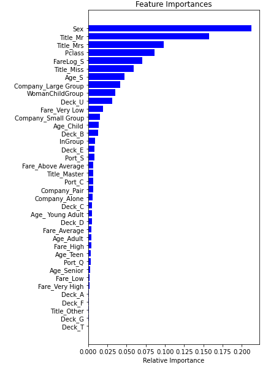

## Titanic survival prediction

The Titanic competition is one of the most popular machine learning competitions on Kaggle. The goal is to predict the fate of the passengers onboard of this unsinkable ship.

  -  Imputed missing values using groupby (e.g. fill missing fare by the median fare by class and title)
  -  Used regex to extract the title from the  passenger name feature
  -  Cleaned the title feature further by correcting wrongly labeled titles and grouping rare titles together
  -   Identified passengers traveling together using their last name and ticket number
  -   Attempted (but failed) to identify the nationality of passengers by their last names
  -   Explored the relation between survival and several features using box plots and bar plots
  -   Optimized Random forest Classifier using GridSearch CV to obtain a top 9% model with 79.2% accuracy

Click [here](https://www.kaggle.com/c/titanice) to go to the Kaggle  competition page.
